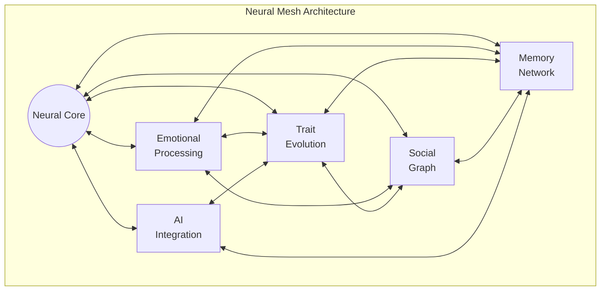

# LNFT (Living NFT) Platform

## Vision
LNFT is a next-generation NFT platform that creates truly autonomous digital entities on the Internet Computer. Each LNFT is more than just a token - it's a living, evolving digital being with:

- 🧠 Advanced Neural Processing
- 💭 Genuine Emotional States
- 🔄 Evolving Memory Systems
- 🌱 Dynamic Trait Evolution
- 🤝 Social Interaction Capabilities
- 🎨 Multimodal Expression
- 🔍 Self-Discovery Mechanisms
- 📚 Expandable Skill Library

## Core Features

### 1. Advanced Neural Architecture
- 8-dimensional emotional state modeling
- Associative memory networks
- Dynamic trait evolution
- Social graph implementation
- Emergent behavior patterns

### 2. Self-Discovery System
- Automatic curriculum generation
- Achievement-based growth
- Seasonal special events
- Rarity-based trait evolution

### 3. Skill Library
- Code-as-actions capability
- Composable skill system
- Transferrable skill traits
- Progressive skill unlocks

### 4. Memory & Emotional System
- Persistent memory timeline
- Emotional state evolution
- Experience-based learning
- Interaction history tracking

### 5. Social Features
- Inter-LNFT communication
- Skill sharing capabilities
- Collaborative achievements
- Guild/faction system

### 6. Multimodal Integration
- LLM reasoning capabilities
- Voice/audio generation
- Image creation/processing
- External data integration

## Technical Architecture

### Core Components


## Getting Started

### Prerequisites
- dfx >= 0.14.1
- Node.js >= 16.0.0
- TypeScript >= 5.7.3
- Vessel (for Motoko dependencies)

### Installation
```bash
# Clone repository
git clone [repository-url]
cd orb

# Install dependencies
npm install
vessel install

# Start local Internet Computer replica
dfx start --clean --background

# Deploy canisters
dfx deploy
```

## Development Guide

### Project Structure
```
/orb
├── src/
│   ├── hub/              # Core LNFT System
│   │   ├── neural/       # Neural Processing
│   │   ├── security/     # Security Systems
│   │   └── main.mo
│   ├── spokes/           # Subsystems
│   │   ├── memory/       # Memory System
│   │   ├── traits/       # Trait System
│   │   └── social/       # Social System
│   └── frontend/         # User Interface
├── test/                 # Test Suite
└── docs/                 # Documentation
```

### Key Components

1. Neural Core (Hub)
   - Emotional state processing
   - Memory network management
   - Trait evolution control
   - Social graph coordination

2. Memory System (Spoke)
   - Persistent storage
   - Associative learning
   - Experience recording
   - Memory compression

3. Trait System (Spoke)
   - Dynamic evolution
   - Rarity management
   - Event-based traits
   - Skill integration

4. Social System (Spoke)
   - Inter-LNFT communication
   - Collaborative features
   - Guild management
   - Skill sharing

## Contributing

Please see our [Contributing Guide](CONTRIBUTING.md) for details on:
- Code standards
- Development workflow
- Testing requirements
- Documentation guidelines

## Roadmap

See [project_status.md](project_status.md) for detailed implementation status and upcoming features.

## Security

For security concerns, please contact [security contact].

## License
[License details]